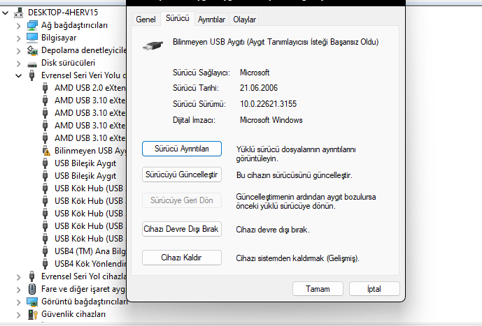
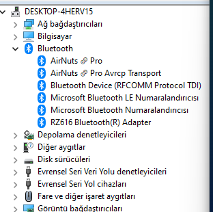

# ACER-NITRO5-BadBluetooth

Complete solution guide of bluetooth driver stop working at random time (Acer Nitro 5)


## Introduction

Have you ever experienced that the Bluetooth Window in the windows taskbar disappears when you start the computer at a random time? If you open device manager at this point you will notice that all bluetooth devices have disappeared. You will also see a device that says "Unknown USB Device (Device Identifier Request Failed)" (yes that's it!).



Unknown device of my ass.

If you do some research on the internet, you'll find that powering off the computer completely, leaving it for 5-10 minutes and then turning it back on solves the problem. But this is a temporary solution and you can't do it on a closed battery laptop like mine (holding the power button down doesn't work either).

I wrote down some of the things I tried here and wrote the solution I found by trial and error in the solution tab. I hope it solves it for you too.


## What can't solve it

Removing all WiFi chip related drivers from Device Manager will not solve it.

Uninstalling the Bluetooth and WiFi drivers from Device Manager, View tab, "Devices by Driver" panel and restarting does not solve it.

Forcibly shutting down the computer (laptop), shutting it down on the bios screen, shutting it down while booting (yes with force) does not solve it.


## Solution

#### TLDR; update 1.10 version BIOS

If it is not the wifi chip device, then we can assume that it is either the driver or Windows.

But since there's nothing I can do at this point, I thought it was the BIOS, assuming it wasn't there before, as a higher solution. 

So I went to the support page and tried to flash the previous BIOS.

```
https://www.acer.com/tr-tr/support/product-support/AN515-46/NH.QGYEY.001/downloads
```

Since I already sent the computer to warranty, they flashed the latest BIOS (1.12).

So I downloaded the previous version (1.10)

But when I opened the program it said that I already had a new version BIOS installed and closed it.

I found out the file location by opening it again. 

```
C:\Windows\Temp\7zSFFFA.tmp\
```

I fixed the security permission and copied that folder to the desktop. (I already uploaded the final draft to the repo).

Then, when I was checking the files, I saw that a few lines of code in the platform.ini file were responsible for version control, so I changed them. (Final draft in repo).


Then I ran the program again and the screen came up as in the image above.

(After allowing the program, the pc will freeze and you will get to the bios flash screen. Make sure you are not in a library or something because your fans will spin like crazy as 12V plugged to fan.)

I then restarted Windows and checked the device driver.

The Unknown Device was gone and a new unknown device appeared in the Bluetooth tab.

After remove it, I restarted Windows and after a few minutes I found all Bluetooth and pre-connected Bluetooth devices installed and working.




## Tag

I'm writing the tags here for people who will encounter the problem and google it

Acer Nitro 5 Bluetooth problem
disappear
Acer AN515-46